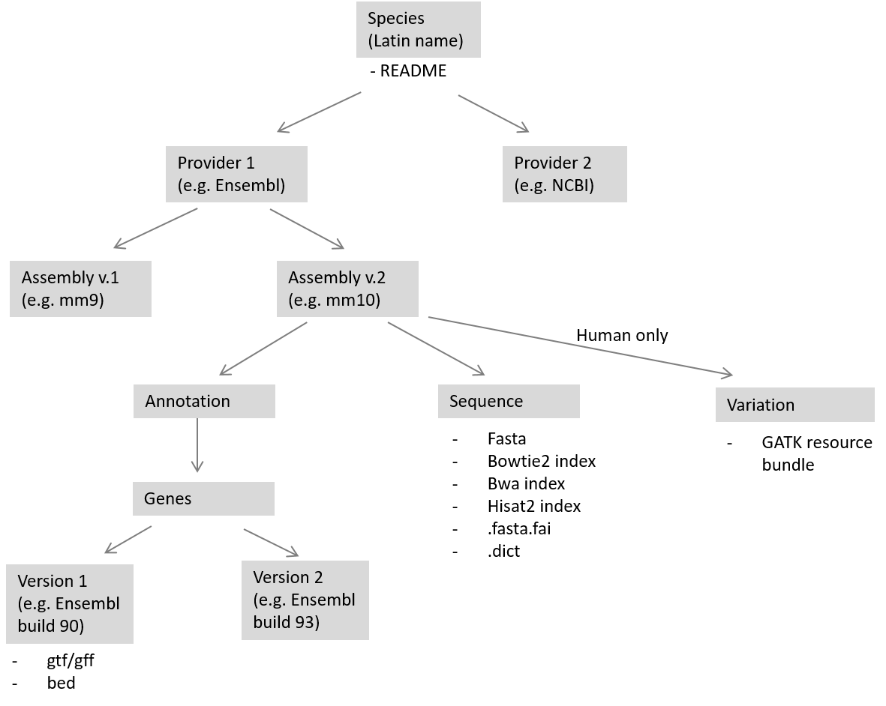

Reference genomes for commonly used taxa are available here: `/data/references`  

**Important**: All cluster users have write permission in this folder. You are welcome to add new files or new species as long as you stick to this structure:

 

Each species-specific folder **must contain a README** with information on (i) when a file was downloaded, (ii) from where it was downloaded and (iii) how it was processed (e.g. how a particular index was built). We will regularly check `data/references` and **delete without warning** any folders/files that do not follow the mandatory structure or are not properly documented.  

Currently available species include:  
- Bos_taurus  
- Canis_lupus_familiaris  
- Capra_hircus  
- Danio_rerio  
- Drosophila_melanogaster  
- Equus_caballus  
- Escherichia_virus_phiX174  
- Gasterosteus_aculeatus  
- Homo_sapiens  
- Mus_musculus  
- Neogobius_melanostomus  
- Ovis_aries  
- Pundamilia_nyererei  
- Rattus_norvegicus  
- Salmo_trutta  
- sDMDMm2_flora  
- Sus_scrofa  
- Xiphorus_maculatus  
